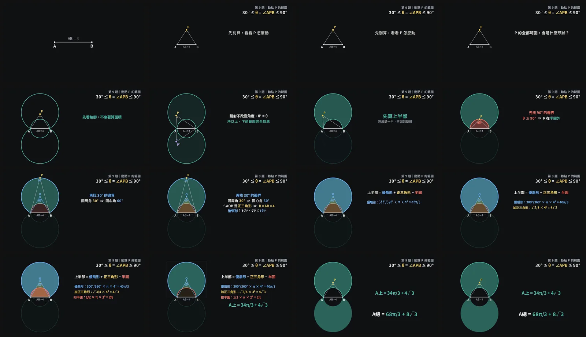

# Carlo Math Manim Slides

An independent collection of slow, intuitive Traditional Chinese mathematics
lessons built with Manim Community and Manim Slides. Each completed lesson is
linked to the exact solution source from [正哥愛數學](https://sites.google.com/chjs.ntpc.edu.tw/carlovemath/).

Question 9 is the reference implementation: it first explores the moving
point, proves upper/lower symmetry, calculates one half, and only then doubles
the area. The same question-first, visual-evidence-first standard applies to
the rest of the collection.



The contact sheet is a representative render preview; its source and license
boundary are recorded in [`docs/previews/README.md`](docs/previews/README.md).

## Current Inventory

<!-- catalog-summary:start -->
The reproducible 2026-07-24 site snapshot records:

- 434 public first-party pages;
- 4,346 unique embedded assets (326 Drive and 4,020 YouTube);
- 2,489 confirmed public, 622 confirmed restricted, and 1,235 unresolved assets; and
- 76 cataloged problem records across 5 collections (62 from the frozen Carlo-site inventory, 14 from the separately supplied pilot): 10 `blocked`, 20 `discovered`, 13 `planned`, 33 `visual_verified`.

Pages, assets, problem records, and completed lesson units are different denominators. Eligibility and production states are tracked separately; placeholders and blocked sources never count as finished lessons.
<!-- catalog-summary:end -->

The site-wide conversion is not complete. The site snapshot and access audit
are complete at the boundary above. The 2,489 confirmed-public assets are the
review pool; most still require problem-level extraction, mathematical review,
and an exact rights decision. The 14-unit ROC 115 pilot is a separately
supplied source and must not be used to imply that every Carlo asset has been
converted.

## Cataloged Problems

<!-- lesson-table:start -->
| Collection / problem | Topic | State | Source files |
| --- | --- | --- | --- |
| CHIAYI 104 SCIENCE · Fill-in Question 1 | problem review pending | `discovered` | [source page](https://sites.google.com/chjs.ntpc.edu.tw/carlovemath/%E5%98%89%E4%B8%AD%E7%A7%91%E5%AD%B8%E7%8F%AD/104%E5%98%89%E4%B8%AD) / [solution](https://www.youtube.com/watch?v=W_kWhz-mRZk) |
| CHIAYI 104 SCIENCE · Fill-in Question 2 | problem review pending | `discovered` | [source page](https://sites.google.com/chjs.ntpc.edu.tw/carlovemath/%E5%98%89%E4%B8%AD%E7%A7%91%E5%AD%B8%E7%8F%AD/104%E5%98%89%E4%B8%AD) / [solution](https://www.youtube.com/watch?v=s1yOPLO3YaY) |
| CHIAYI 104 SCIENCE · Fill-in Question 3 | problem review pending | `discovered` | [source page](https://sites.google.com/chjs.ntpc.edu.tw/carlovemath/%E5%98%89%E4%B8%AD%E7%A7%91%E5%AD%B8%E7%8F%AD/104%E5%98%89%E4%B8%AD) / [solution](https://www.youtube.com/watch?v=zot-342e0MA) |
| CHIAYI 104 SCIENCE · Fill-in Question 4 | problem review pending | `discovered` | [source page](https://sites.google.com/chjs.ntpc.edu.tw/carlovemath/%E5%98%89%E4%B8%AD%E7%A7%91%E5%AD%B8%E7%8F%AD/104%E5%98%89%E4%B8%AD) / [solution](https://www.youtube.com/watch?v=ECRtvRq9Kq8) |
| CHIAYI 104 SCIENCE · Fill-in Question 5 | problem review pending | `discovered` | [source page](https://sites.google.com/chjs.ntpc.edu.tw/carlovemath/%E5%98%89%E4%B8%AD%E7%A7%91%E5%AD%B8%E7%8F%AD/104%E5%98%89%E4%B8%AD) / [solution](https://www.youtube.com/watch?v=y_oaSlysuNE) |
| CHIAYI 104 SCIENCE · Fill-in Question 6 | problem review pending | `discovered` | [source page](https://sites.google.com/chjs.ntpc.edu.tw/carlovemath/%E5%98%89%E4%B8%AD%E7%A7%91%E5%AD%B8%E7%8F%AD/104%E5%98%89%E4%B8%AD) / [solution](https://www.youtube.com/watch?v=pRzUo1icNrc) |
| CHIAYI 104 SCIENCE · Fill-in Question 7 | problem review pending | `discovered` | [source page](https://sites.google.com/chjs.ntpc.edu.tw/carlovemath/%E5%98%89%E4%B8%AD%E7%A7%91%E5%AD%B8%E7%8F%AD/104%E5%98%89%E4%B8%AD) / [solution](https://www.youtube.com/watch?v=FfW3DsDlxnw) |
| CHIAYI 104 SCIENCE · Fill-in Question 8 | problem review pending | `discovered` | [source page](https://sites.google.com/chjs.ntpc.edu.tw/carlovemath/%E5%98%89%E4%B8%AD%E7%A7%91%E5%AD%B8%E7%8F%AD/104%E5%98%89%E4%B8%AD) / [solution](https://www.youtube.com/watch?v=MXeg2E09itU) |
| CHIAYI 104 SCIENCE · Fill-in Question 9 | problem review pending | `discovered` | [source page](https://sites.google.com/chjs.ntpc.edu.tw/carlovemath/%E5%98%89%E4%B8%AD%E7%A7%91%E5%AD%B8%E7%8F%AD/104%E5%98%89%E4%B8%AD) / [solution](https://www.youtube.com/watch?v=o941qR1MKns) |
| CHIAYI 104 SCIENCE · Fill-in Question 10 | problem review pending | `discovered` | [source page](https://sites.google.com/chjs.ntpc.edu.tw/carlovemath/%E5%98%89%E4%B8%AD%E7%A7%91%E5%AD%B8%E7%8F%AD/104%E5%98%89%E4%B8%AD) / [solution](https://www.youtube.com/watch?v=b6a-FaCgcw4) |
| CHIAYI 104 SCIENCE · Fill-in Question 11 | problem review pending | `discovered` | [source page](https://sites.google.com/chjs.ntpc.edu.tw/carlovemath/%E5%98%89%E4%B8%AD%E7%A7%91%E5%AD%B8%E7%8F%AD/104%E5%98%89%E4%B8%AD) / [solution](https://www.youtube.com/watch?v=DRJjJQASXds) |
| CHIAYI 104 SCIENCE · Fill-in Question 12 | problem review pending | `discovered` | [source page](https://sites.google.com/chjs.ntpc.edu.tw/carlovemath/%E5%98%89%E4%B8%AD%E7%A7%91%E5%AD%B8%E7%8F%AD/104%E5%98%89%E4%B8%AD) / [solution](https://www.youtube.com/watch?v=uwcROoBq2Fw) |
| CHIAYI 104 SCIENCE · Fill-in Question 13 | problem review pending | `discovered` | [source page](https://sites.google.com/chjs.ntpc.edu.tw/carlovemath/%E5%98%89%E4%B8%AD%E7%A7%91%E5%AD%B8%E7%8F%AD/104%E5%98%89%E4%B8%AD) / [solution](https://www.youtube.com/watch?v=ZPUmIli7GyY) |
| CHIAYI 104 SCIENCE · Fill-in Question 14 | problem review pending | `discovered` | [source page](https://sites.google.com/chjs.ntpc.edu.tw/carlovemath/%E5%98%89%E4%B8%AD%E7%A7%91%E5%AD%B8%E7%8F%AD/104%E5%98%89%E4%B8%AD) / [solution](https://www.youtube.com/watch?v=HcwPaLdkcpE) |
| CHIAYI 104 SCIENCE · Fill-in Question 15 | problem review pending | `discovered` | [source page](https://sites.google.com/chjs.ntpc.edu.tw/carlovemath/%E5%98%89%E4%B8%AD%E7%A7%91%E5%AD%B8%E7%8F%AD/104%E5%98%89%E4%B8%AD) / [solution](https://www.youtube.com/watch?v=OpW0cHAHIW8) |
| CHIAYI 104 SCIENCE · Fill-in Question 16 | problem review pending | `discovered` | [source page](https://sites.google.com/chjs.ntpc.edu.tw/carlovemath/%E5%98%89%E4%B8%AD%E7%A7%91%E5%AD%B8%E7%8F%AD/104%E5%98%89%E4%B8%AD) / [solution](https://www.youtube.com/watch?v=5PVm9Q6QUhs) |
| CHIAYI 104 SCIENCE · Fill-in Question 17 | problem review pending | `discovered` | [source page](https://sites.google.com/chjs.ntpc.edu.tw/carlovemath/%E5%98%89%E4%B8%AD%E7%A7%91%E5%AD%B8%E7%8F%AD/104%E5%98%89%E4%B8%AD) / [solution](https://www.youtube.com/watch?v=WcizHiRP6F0) |
| CHIAYI 104 SCIENCE · Fill-in Question 18 | problem review pending | `discovered` | [source page](https://sites.google.com/chjs.ntpc.edu.tw/carlovemath/%E5%98%89%E4%B8%AD%E7%A7%91%E5%AD%B8%E7%8F%AD/104%E5%98%89%E4%B8%AD) / [solution](https://www.youtube.com/watch?v=vmIV_qEJA4w) |
| CHIAYI 104 SCIENCE · Fill-in Question 19 | problem review pending | `discovered` | [source page](https://sites.google.com/chjs.ntpc.edu.tw/carlovemath/%E5%98%89%E4%B8%AD%E7%A7%91%E5%AD%B8%E7%8F%AD/104%E5%98%89%E4%B8%AD) / [solution](https://www.youtube.com/watch?v=Zk6h48VT6K4) |
| CHIAYI 104 SCIENCE · Fill-in Question 20 | problem review pending | `discovered` | [source page](https://sites.google.com/chjs.ntpc.edu.tw/carlovemath/%E5%98%89%E4%B8%AD%E7%A7%91%E5%AD%B8%E7%8F%AD/104%E5%98%89%E4%B8%AD) / [solution](https://www.youtube.com/watch?v=CZOGxLjo-JI) |
| TCFS 112 MATH GIFTED · Fill-in Question 1 | arithmetic progressions and place-value optimization | `visual_verified` | [metadata](lessons/tcfs_112_math_gifted/q01/lesson.toml) / [scene](lessons/tcfs_112_math_gifted/q01/deck.py) / [script](lessons/tcfs_112_math_gifted/q01/presenter.zh-TW.md) / [solution](https://www.youtube.com/watch?v=GGVENizPImM) |
| TCFS 112 MATH GIFTED · Fill-in Question 2 | topic review pending | `planned` | [metadata](lessons/tcfs_112_math_gifted/q02/lesson.toml) / [scene](lessons/tcfs_112_math_gifted/q02/deck.py) / [script](lessons/tcfs_112_math_gifted/q02/presenter.zh-TW.md) / [solution](https://www.youtube.com/watch?v=HEkjXNCB3g8) |
| TCFS 112 MATH GIFTED · Fill-in Question 3 | topic review pending | `planned` | [metadata](lessons/tcfs_112_math_gifted/q03/lesson.toml) / [scene](lessons/tcfs_112_math_gifted/q03/deck.py) / [script](lessons/tcfs_112_math_gifted/q03/presenter.zh-TW.md) / [solution](https://www.youtube.com/watch?v=SlZg1LfjbrE) |
| TCFS 112 MATH GIFTED · Fill-in Question 4 | topic review pending | `planned` | [source page](https://sites.google.com/chjs.ntpc.edu.tw/carlovemath/%E4%B8%AD%E4%B8%80%E4%B8%AD%E8%B3%87%E5%84%AA%E7%8F%AD/112%E4%B8%AD%E4%B8%80%E4%B8%AD%E8%B3%87) / [solution](https://www.youtube.com/watch?v=K9kwq9apPR0) |
| TCFS 112 MATH GIFTED · Fill-in Question 5 | topic review pending | `planned` | [source page](https://sites.google.com/chjs.ntpc.edu.tw/carlovemath/%E4%B8%AD%E4%B8%80%E4%B8%AD%E8%B3%87%E5%84%AA%E7%8F%AD/112%E4%B8%AD%E4%B8%80%E4%B8%AD%E8%B3%87) / [solution](https://www.youtube.com/watch?v=dMXJ-FbZKxU) |
| TCFS 112 MATH GIFTED · Fill-in Question 6 | topic review pending | `planned` | [source page](https://sites.google.com/chjs.ntpc.edu.tw/carlovemath/%E4%B8%AD%E4%B8%80%E4%B8%AD%E8%B3%87%E5%84%AA%E7%8F%AD/112%E4%B8%AD%E4%B8%80%E4%B8%AD%E8%B3%87) / [solution](https://www.youtube.com/watch?v=t9wHX49OZPM) |
| TCFS 112 MATH GIFTED · Fill-in Question 7 | topic review pending | `planned` | [source page](https://sites.google.com/chjs.ntpc.edu.tw/carlovemath/%E4%B8%AD%E4%B8%80%E4%B8%AD%E8%B3%87%E5%84%AA%E7%8F%AD/112%E4%B8%AD%E4%B8%80%E4%B8%AD%E8%B3%87) / [solution](https://www.youtube.com/watch?v=RJcla7jv85g) |
| TCFS 112 MATH GIFTED · Fill-in Question 8 | topic review pending | `planned` | [source page](https://sites.google.com/chjs.ntpc.edu.tw/carlovemath/%E4%B8%AD%E4%B8%80%E4%B8%AD%E8%B3%87%E5%84%AA%E7%8F%AD/112%E4%B8%AD%E4%B8%80%E4%B8%AD%E8%B3%87) / [solution](https://www.youtube.com/watch?v=yxlLBTcz4kg) |
| TCFS 112 MATH GIFTED · Fill-in Question 9 | topic review pending | `planned` | [source page](https://sites.google.com/chjs.ntpc.edu.tw/carlovemath/%E4%B8%AD%E4%B8%80%E4%B8%AD%E8%B3%87%E5%84%AA%E7%8F%AD/112%E4%B8%AD%E4%B8%80%E4%B8%AD%E8%B3%87) / [solution](https://www.youtube.com/watch?v=E8hGcX6oQO4) |
| TCFS 112 MATH GIFTED · Fill-in Question 10 | topic review pending | `planned` | [source page](https://sites.google.com/chjs.ntpc.edu.tw/carlovemath/%E4%B8%AD%E4%B8%80%E4%B8%AD%E8%B3%87%E5%84%AA%E7%8F%AD/112%E4%B8%AD%E4%B8%80%E4%B8%AD%E8%B3%87) / [solution](https://www.youtube.com/watch?v=W9yrKSMoY-0) |
| TCFS 112 MATH GIFTED · Fill-in Question 11 | topic review pending | `planned` | [source page](https://sites.google.com/chjs.ntpc.edu.tw/carlovemath/%E4%B8%AD%E4%B8%80%E4%B8%AD%E8%B3%87%E5%84%AA%E7%8F%AD/112%E4%B8%AD%E4%B8%80%E4%B8%AD%E8%B3%87) / [solution](https://www.youtube.com/watch?v=WHaIgarL3nM) |
| TCFS 112 MATH GIFTED · Fill-in Question 12 | topic review pending | `planned` | [source page](https://sites.google.com/chjs.ntpc.edu.tw/carlovemath/%E4%B8%AD%E4%B8%80%E4%B8%AD%E8%B3%87%E5%84%AA%E7%8F%AD/112%E4%B8%AD%E4%B8%80%E4%B8%AD%E8%B3%87) / [solution](https://www.youtube.com/watch?v=3clUyeUgvOg) |
| TCFS 112 MATH GIFTED · Fill-in Question 13 | topic review pending | `planned` | [source page](https://sites.google.com/chjs.ntpc.edu.tw/carlovemath/%E4%B8%AD%E4%B8%80%E4%B8%AD%E8%B3%87%E5%84%AA%E7%8F%AD/112%E4%B8%AD%E4%B8%80%E4%B8%AD%E8%B3%87) / [solution](https://www.youtube.com/watch?v=nEbzWC6QD7g) |
| TCFS 112 MATH GIFTED · Proof Question 1 | topic review pending | `planned` | [source page](https://sites.google.com/chjs.ntpc.edu.tw/carlovemath/%E4%B8%AD%E4%B8%80%E4%B8%AD%E8%B3%87%E5%84%AA%E7%8F%AD/112%E4%B8%AD%E4%B8%80%E4%B8%AD%E8%B3%87) / [solution](https://www.youtube.com/watch?v=JisNVawr1NM) |
| TCFS 113 MATH GIFTED · Fill-in Question 1 | exponential equations and positive-integer counting | `visual_verified` | [metadata](lessons/tcfs_113_math_gifted/q01/lesson.toml) / [scene](lessons/tcfs_113_math_gifted/q01/deck.py) / [script](lessons/tcfs_113_math_gifted/q01/presenter.zh-TW.md) / [solution](https://www.youtube.com/watch?v=FSGAuRvRFU0) |
| TCFS 113 MATH GIFTED · Fill-in Question 2 | binary strings and balanced position sums | `visual_verified` | [metadata](lessons/tcfs_113_math_gifted/q02/lesson.toml) / [scene](lessons/tcfs_113_math_gifted/q02/deck.py) / [script](lessons/tcfs_113_math_gifted/q02/presenter.zh-TW.md) / [solution](https://www.youtube.com/watch?v=FSGAuRvRFU0) |
| TCFS 113 MATH GIFTED · Fill-in Question 3 | median versus mean and gap counting | `visual_verified` | [metadata](lessons/tcfs_113_math_gifted/q03/lesson.toml) / [scene](lessons/tcfs_113_math_gifted/q03/deck.py) / [script](lessons/tcfs_113_math_gifted/q03/presenter.zh-TW.md) / [solution](https://www.youtube.com/watch?v=W-NGUVPlcOc) |
| TCFS 113 MATH GIFTED · Fill-in Question 4 | acute triangles with consecutive integer sides | `visual_verified` | [metadata](lessons/tcfs_113_math_gifted/q04/lesson.toml) / [scene](lessons/tcfs_113_math_gifted/q04/deck.py) / [script](lessons/tcfs_113_math_gifted/q04/presenter.zh-TW.md) / [solution](https://www.youtube.com/watch?v=W-NGUVPlcOc) |
| TCFS 113 MATH GIFTED · Fill-in Question 5 | sparse polynomial expansion and binary exponents | `visual_verified` | [metadata](lessons/tcfs_113_math_gifted/q05/lesson.toml) / [scene](lessons/tcfs_113_math_gifted/q05/deck.py) / [script](lessons/tcfs_113_math_gifted/q05/presenter.zh-TW.md) / [solution](https://www.youtube.com/watch?v=Hypdc2fqjfM) |
| TCFS 113 MATH GIFTED · Fill-in Question 6 | arithmetic and geometric progressions | `visual_verified` | [metadata](lessons/tcfs_113_math_gifted/q06/lesson.toml) / [scene](lessons/tcfs_113_math_gifted/q06/deck.py) / [script](lessons/tcfs_113_math_gifted/q06/presenter.zh-TW.md) / [solution](https://www.youtube.com/watch?v=Hypdc2fqjfM) |
| TCFS 113 MATH GIFTED · Fill-in Question 7 | quadratic fixed points and interval invariance | `visual_verified` | [metadata](lessons/tcfs_113_math_gifted/q07/lesson.toml) / [scene](lessons/tcfs_113_math_gifted/q07/deck.py) / [script](lessons/tcfs_113_math_gifted/q07/presenter.zh-TW.md) / [solution](https://www.youtube.com/watch?v=xRrA7_xEStU) |
| TCFS 113 MATH GIFTED · Fill-in Question 8 | coordinate geometry and area bisection | `visual_verified` | [metadata](lessons/tcfs_113_math_gifted/q08/lesson.toml) / [scene](lessons/tcfs_113_math_gifted/q08/deck.py) / [script](lessons/tcfs_113_math_gifted/q08/presenter.zh-TW.md) / [solution](https://www.youtube.com/watch?v=xRrA7_xEStU) |
| TCFS 113 MATH GIFTED · Fill-in Question 9 | consecutive integer sums and exhaustive bounds | `visual_verified` | [metadata](lessons/tcfs_113_math_gifted/q09/lesson.toml) / [scene](lessons/tcfs_113_math_gifted/q09/deck.py) / [script](lessons/tcfs_113_math_gifted/q09/presenter.zh-TW.md) / [solution](https://www.youtube.com/watch?v=X6Cabjm94eY) |
| TCFS 113 MATH GIFTED · Fill-in Question 10 | reflection and shortest paths | `visual_verified` | [metadata](lessons/tcfs_113_math_gifted/q10/lesson.toml) / [scene](lessons/tcfs_113_math_gifted/q10/deck.py) / [script](lessons/tcfs_113_math_gifted/q10/presenter.zh-TW.md) / [solution](https://www.youtube.com/watch?v=X6Cabjm94eY) |
| TCFS 113 MATH GIFTED · Fill-in Question 11 | digit indexing in concatenated square numbers | `visual_verified` | [metadata](lessons/tcfs_113_math_gifted/q11/lesson.toml) / [scene](lessons/tcfs_113_math_gifted/q11/deck.py) / [script](lessons/tcfs_113_math_gifted/q11/presenter.zh-TW.md) / [solution](https://www.youtube.com/watch?v=FxSdkChC9Z8) |
| TCFS 113 MATH GIFTED · Fill-in Question 12 | centroids and constrained quadratic optimization | `visual_verified` | [metadata](lessons/tcfs_113_math_gifted/q12/lesson.toml) / [scene](lessons/tcfs_113_math_gifted/q12/deck.py) / [script](lessons/tcfs_113_math_gifted/q12/presenter.zh-TW.md) / [solution](https://www.youtube.com/watch?v=FxSdkChC9Z8) |
| TCFS 113 MATH GIFTED · Fill-in Question 13 | cubic bounds and integer factorization | `visual_verified` | [metadata](lessons/tcfs_113_math_gifted/q13/lesson.toml) / [scene](lessons/tcfs_113_math_gifted/q13/deck.py) / [script](lessons/tcfs_113_math_gifted/q13/presenter.zh-TW.md) / [solution](https://www.youtube.com/watch?v=zUVNQX92b64) |
| TCFS 113 MATH GIFTED · Proof Question 1 | iterated angle constructions and an invariant product | `visual_verified` | [metadata](lessons/tcfs_113_math_gifted/p2q01/lesson.toml) / [scene](lessons/tcfs_113_math_gifted/p2q01/deck.py) / [script](lessons/tcfs_113_math_gifted/p2q01/presenter.zh-TW.md) / [solution](https://www.youtube.com/watch?v=rw7Z1rw7gYA) |
| TCFS 114 MATH GIFTED · Fill-in Question 1 | anti-diagonal number patterns | `visual_verified` | [metadata](lessons/tcfs_114_math_gifted/q01/lesson.toml) / [scene](lessons/tcfs_114_math_gifted/q01/deck.py) / [script](lessons/tcfs_114_math_gifted/q01/presenter.zh-TW.md) / [solution](https://www.youtube.com/watch?v=oRepfpw90Fg) |
| TCFS 114 MATH GIFTED · Fill-in Question 2 | quadratic functions and quadrants | `visual_verified` | [metadata](lessons/tcfs_114_math_gifted/q02/lesson.toml) / [scene](lessons/tcfs_114_math_gifted/q02/deck.py) / [script](lessons/tcfs_114_math_gifted/q02/presenter.zh-TW.md) / [solution](https://www.youtube.com/watch?v=CeH9yZ8pnc0) |
| TCFS 114 MATH GIFTED · Fill-in Question 3 | cube and regular-octahedron volumes | `visual_verified` | [metadata](lessons/tcfs_114_math_gifted/q03/lesson.toml) / [scene](lessons/tcfs_114_math_gifted/q03/deck.py) / [script](lessons/tcfs_114_math_gifted/q03/presenter.zh-TW.md) / [solution](https://www.youtube.com/watch?v=MUhQmAz9OvE) |
| TCFS 114 MATH GIFTED · Fill-in Question 4 | solution access blocked | `blocked` | [source page](https://sites.google.com/chjs.ntpc.edu.tw/carlovemath/%E4%B8%AD%E4%B8%80%E4%B8%AD%E8%B3%87%E5%84%AA%E7%8F%AD/114%E4%B8%AD%E4%B8%80%E4%B8%AD%E8%B3%87) |
| TCFS 114 MATH GIFTED · Fill-in Question 5 | solution access blocked | `blocked` | [source page](https://sites.google.com/chjs.ntpc.edu.tw/carlovemath/%E4%B8%AD%E4%B8%80%E4%B8%AD%E8%B3%87%E5%84%AA%E7%8F%AD/114%E4%B8%AD%E4%B8%80%E4%B8%AD%E8%B3%87) |
| TCFS 114 MATH GIFTED · Fill-in Question 6 | solution access blocked | `blocked` | [source page](https://sites.google.com/chjs.ntpc.edu.tw/carlovemath/%E4%B8%AD%E4%B8%80%E4%B8%AD%E8%B3%87%E5%84%AA%E7%8F%AD/114%E4%B8%AD%E4%B8%80%E4%B8%AD%E8%B3%87) |
| TCFS 114 MATH GIFTED · Fill-in Question 7 | solution access blocked | `blocked` | [source page](https://sites.google.com/chjs.ntpc.edu.tw/carlovemath/%E4%B8%AD%E4%B8%80%E4%B8%AD%E8%B3%87%E5%84%AA%E7%8F%AD/114%E4%B8%AD%E4%B8%80%E4%B8%AD%E8%B3%87) |
| TCFS 114 MATH GIFTED · Fill-in Question 8 | solution access blocked | `blocked` | [source page](https://sites.google.com/chjs.ntpc.edu.tw/carlovemath/%E4%B8%AD%E4%B8%80%E4%B8%AD%E8%B3%87%E5%84%AA%E7%8F%AD/114%E4%B8%AD%E4%B8%80%E4%B8%AD%E8%B3%87) |
| TCFS 114 MATH GIFTED · Fill-in Question 9 | solution access blocked | `blocked` | [source page](https://sites.google.com/chjs.ntpc.edu.tw/carlovemath/%E4%B8%AD%E4%B8%80%E4%B8%AD%E8%B3%87%E5%84%AA%E7%8F%AD/114%E4%B8%AD%E4%B8%80%E4%B8%AD%E8%B3%87) |
| TCFS 114 MATH GIFTED · Fill-in Question 10 | solution access blocked | `blocked` | [source page](https://sites.google.com/chjs.ntpc.edu.tw/carlovemath/%E4%B8%AD%E4%B8%80%E4%B8%AD%E8%B3%87%E5%84%AA%E7%8F%AD/114%E4%B8%AD%E4%B8%80%E4%B8%AD%E8%B3%87) |
| TCFS 114 MATH GIFTED · Fill-in Question 11 | solution access blocked | `blocked` | [source page](https://sites.google.com/chjs.ntpc.edu.tw/carlovemath/%E4%B8%AD%E4%B8%80%E4%B8%AD%E8%B3%87%E5%84%AA%E7%8F%AD/114%E4%B8%AD%E4%B8%80%E4%B8%AD%E8%B3%87) |
| TCFS 114 MATH GIFTED · Fill-in Question 12 | solution access blocked | `blocked` | [source page](https://sites.google.com/chjs.ntpc.edu.tw/carlovemath/%E4%B8%AD%E4%B8%80%E4%B8%AD%E8%B3%87%E5%84%AA%E7%8F%AD/114%E4%B8%AD%E4%B8%80%E4%B8%AD%E8%B3%87) |
| TCFS 114 MATH GIFTED · Fill-in Question 13 | floor and fractional-part equations | `visual_verified` | [metadata](lessons/tcfs_114_math_gifted/q13/lesson.toml) / [scene](lessons/tcfs_114_math_gifted/q13/deck.py) / [script](lessons/tcfs_114_math_gifted/q13/presenter.zh-TW.md) / [solution](https://www.youtube.com/watch?v=Eq_1v5YG5bs) |
| TCFS 114 MATH GIFTED · Fill-in Question 14 | solution access blocked | `blocked` | [source page](https://sites.google.com/chjs.ntpc.edu.tw/carlovemath/%E4%B8%AD%E4%B8%80%E4%B8%AD%E8%B3%87%E5%84%AA%E7%8F%AD/114%E4%B8%AD%E4%B8%80%E4%B8%AD%E8%B3%87) |
| TCFS 115 MATH GIFTED · Part 1, Question 1 | angle bisectors | `visual_verified` | [metadata](lessons/tcfs_115_math_gifted/q01/lesson.toml) / [scene](lessons/tcfs_115_math_gifted/q01/deck.py) / [script](lessons/tcfs_115_math_gifted/q01/presenter.zh-TW.md) |
| TCFS 115 MATH GIFTED · Part 1, Question 2 | equal-area rectangles | `visual_verified` | [metadata](lessons/tcfs_115_math_gifted/q02/lesson.toml) / [scene](lessons/tcfs_115_math_gifted/q02/deck.py) / [script](lessons/tcfs_115_math_gifted/q02/presenter.zh-TW.md) |
| TCFS 115 MATH GIFTED · Part 1, Question 3 | quadratic functions | `visual_verified` | [metadata](lessons/tcfs_115_math_gifted/q03/lesson.toml) / [scene](lessons/tcfs_115_math_gifted/q03/deck.py) / [script](lessons/tcfs_115_math_gifted/q03/presenter.zh-TW.md) |
| TCFS 115 MATH GIFTED · Part 1, Question 4 | sequences and number-line motion | `visual_verified` | [metadata](lessons/tcfs_115_math_gifted/q04/lesson.toml) / [scene](lessons/tcfs_115_math_gifted/q04/deck.py) / [script](lessons/tcfs_115_math_gifted/q04/presenter.zh-TW.md) |
| TCFS 115 MATH GIFTED · Part 1, Question 5 | proportional sequences | `visual_verified` | [metadata](lessons/tcfs_115_math_gifted/q05/lesson.toml) / [scene](lessons/tcfs_115_math_gifted/q05/deck.py) / [script](lessons/tcfs_115_math_gifted/q05/presenter.zh-TW.md) |
| TCFS 115 MATH GIFTED · Part 1, Question 6 | integer factorization and triangles | `visual_verified` | [metadata](lessons/tcfs_115_math_gifted/q06/lesson.toml) / [scene](lessons/tcfs_115_math_gifted/q06/deck.py) / [script](lessons/tcfs_115_math_gifted/q06/presenter.zh-TW.md) |
| TCFS 115 MATH GIFTED · Part 1, Question 7 | radical conjugates | `visual_verified` | [metadata](lessons/tcfs_115_math_gifted/q07/lesson.toml) / [scene](lessons/tcfs_115_math_gifted/q07/deck.py) / [script](lessons/tcfs_115_math_gifted/q07/presenter.zh-TW.md) |
| TCFS 115 MATH GIFTED · Part 1, Question 8 | quadratic graph intersections | `visual_verified` | [metadata](lessons/tcfs_115_math_gifted/q08/lesson.toml) / [scene](lessons/tcfs_115_math_gifted/q08/deck.py) / [script](lessons/tcfs_115_math_gifted/q08/presenter.zh-TW.md) |
| TCFS 115 MATH GIFTED · Part 1, Question 9 | moving-point locus and area | `visual_verified` | [metadata](lessons/tcfs_115_math_gifted/q09/lesson.toml) / [scene](question_9_slide.py) / [script](question_9_presenter_script.md) |
| TCFS 115 MATH GIFTED · Part 1, Question 10 | inequality bounds | `visual_verified` | [metadata](lessons/tcfs_115_math_gifted/q10/lesson.toml) / [scene](lessons/tcfs_115_math_gifted/q10/deck.py) / [script](lessons/tcfs_115_math_gifted/q10/presenter.zh-TW.md) |
| TCFS 115 MATH GIFTED · Part 1, Question 11 | cube plane section | `visual_verified` | [metadata](lessons/tcfs_115_math_gifted/q11/lesson.toml) / [scene](lessons/tcfs_115_math_gifted/q11/deck.py) / [script](lessons/tcfs_115_math_gifted/q11/presenter.zh-TW.md) |
| TCFS 115 MATH GIFTED · Part 1, Question 12 | rotation and shortest path | `visual_verified` | [metadata](lessons/tcfs_115_math_gifted/q12/lesson.toml) / [scene](lessons/tcfs_115_math_gifted/q12/deck.py) / [script](lessons/tcfs_115_math_gifted/q12/presenter.zh-TW.md) |
| TCFS 115 MATH GIFTED · Part 2, Question 1 | symmetric equation systems | `visual_verified` | [metadata](lessons/tcfs_115_math_gifted/p2q01/lesson.toml) / [scene](lessons/tcfs_115_math_gifted/p2q01/deck.py) / [script](lessons/tcfs_115_math_gifted/p2q01/presenter.zh-TW.md) |
| TCFS 115 MATH GIFTED · Part 2, Question 2 | angle-bisector length identity | `visual_verified` | [metadata](lessons/tcfs_115_math_gifted/p2q02/lesson.toml) / [scene](lessons/tcfs_115_math_gifted/p2q02/deck.py) / [script](lessons/tcfs_115_math_gifted/p2q02/presenter.zh-TW.md) |
<!-- lesson-table:end -->

## Setup And Use

Install [Pixi](https://pixi.sh/), then run:

```bash
pixi install
pixi run prepare-tex
pixi run render-q9
pixi run present-q9
```

`prepare-tex` downloads the resource bundle pinned by Tectonic 0.16.9 during
setup, verifies an actual XDV-to-SVG conversion, and then keeps equation
rendering network-free. It uses an existing `dvisvgm` when available. On
Fedora, if `dvisvgm` is absent, it downloads and extracts the distribution's
`dvisvgm` and AMS outline-font RPMs into ignored `build/` storage without
`sudo`; other systems ask for the native package before continuing. Setup
fails closed if the generated SVG contains missing glyph definitions.

List, render, present, and export cataloged lessons with:

```bash
pixi run lessons list
pixi run lessons render --status visual_verified --jobs 2 --quality l
pixi run lessons present carlo.tcfs_115_math_gifted.q09
pixi run lessons export --status visual_verified --jobs 2
```

Generated videos, Slides manifests, HTML, QA frames, and logs stay in ignored
build directories. Compact source-bound QA attestations under `qa/` make the
verified state checkable from a clean clone without committing media.

Refresh the public source inventory and its flattened registry with:

```bash
pixi run inventory-site
pixi run build-source-catalog
pixi run update-readme
```

## Sources And License

Solution provenance is documented in `SOURCES.md`. The site-owner permission
gate and its privacy boundary are documented in
`docs/provenance/CARLO_PERMISSION.md`.

The exact `LICENSE` file contains CC0-1.0. CC0 applies only to the project-owned
paths explicitly listed in `NOTICE.md`; source material, dependencies, and
unreviewed adapted expression retain their respective status. Source credit is
required by this project's academic-integrity policy even where CC0 would not
legally require attribution.

This project is independent and does not imply endorsement by Carlo, the
schools or contests represented in source material, 3Blue1Brown, Manim, or
Manim Slides.
