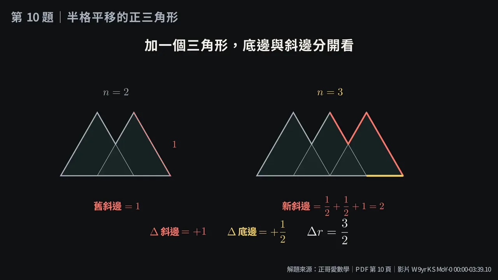
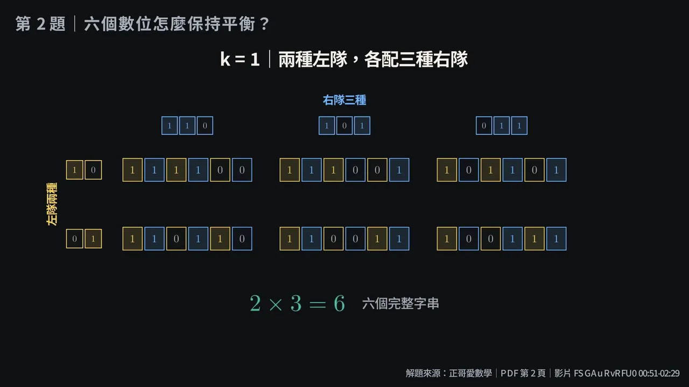
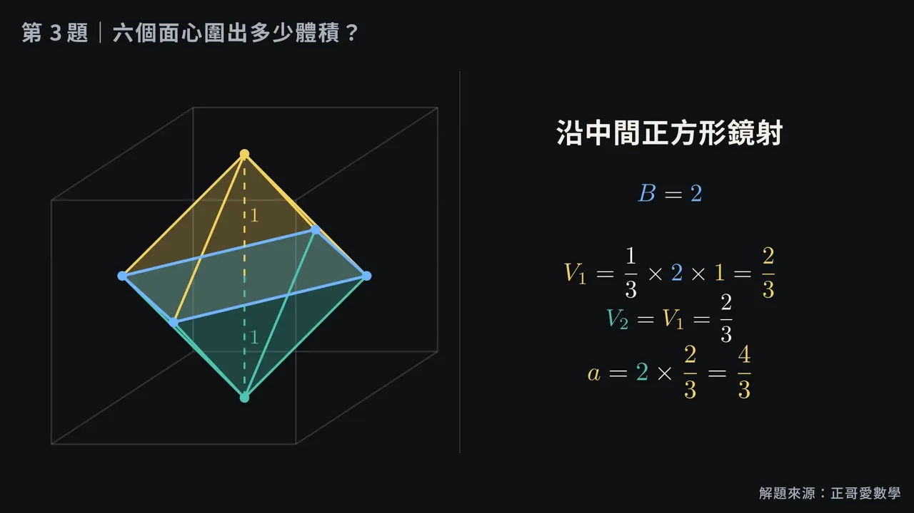

# Math Manim Slides

An independent collection of intuitive Traditional Chinese mathematics
lessons built with Manim Community and Manim Slides. Every completed lesson is
linked to its exact problem and solution sources. Each source cohort keeps its
own provenance, permission, and rights records in the same repository.

Lessons begin with a concrete object or question, keep the relevant structure
visible while it changes, and introduce notation only after the corresponding
relationship can be seen. Each deck is a teacher-led worked example with a
Traditional Chinese presenter script, independently checked mathematics, and
source-bound metadata.

The repository is also a reproducible environment for AI-assisted Manim lesson
production. The current rendered lessons have passed mechanical checks but
remain `draft_rendered` until an independent human review; do not treat them as
verified teaching materials.

Project-authored software and educational expression are licensed only within
the path-based scope in [`NOTICE.md`](NOTICE.md). Source problems and solutions
retain their respective rights. Public teaching, reuse, and adaptation must
follow the collection-specific records in [`docs/provenance/`](docs/provenance/)
rather than assuming blanket permission.

## Lesson Examples

These settled frames show three of the collection's visual approaches. Open an
image to inspect the full 1280x720 preview.

<table>
  <tr>
    <td width="33%">
      <a href="docs/previews/growing-pattern-perimeter.webp"></a>
    </td>
    <td width="33%">
      <a href="docs/previews/balanced-binary-cases.webp"></a>
    </td>
    <td width="33%">
      <a href="docs/previews/octahedron-volume.webp"></a>
    </td>
  </tr>
  <tr>
    <td><strong><a href="lessons/tcfs_112_math_gifted/q10/lesson.toml">Growing patterns</a></strong><br />Compare consecutive constructions before naming the increment.</td>
    <td><strong><a href="lessons/tcfs_113_math_gifted/q02/lesson.toml">Finite counting</a></strong><br />Enumerate complete cases before compressing them into a formula.</td>
    <td><strong><a href="lessons/tcfs_114_math_gifted/q03/lesson.toml">Solid geometry</a></strong><br />Keep the decomposition visible while each volume term is built.</td>
  </tr>
</table>

These are project-rendered screenshots rather than source scans. Their exact
lesson provenance and license boundary are recorded in
[`docs/previews/README.md`](docs/previews/README.md).

## Current Inventory

<!-- catalog-summary:start -->
The reproducible 2026-07-24 Carlo-site snapshot records:

- 434 public first-party pages;
- 4,346 unique embedded assets (326 Drive and 4,020 YouTube);
- 2,489 confirmed public, 622 confirmed restricted, and 1,235 unresolved assets; and
- 76 cataloged problem records across 5 collections (62 from the frozen Carlo-site inventory, 14 from the separately supplied pilot): 10 `blocked`, 20 `discovered`, 46 `draft_rendered`.

Pages, assets, problem records, and completed lesson units are different denominators. Eligibility and production states are tracked separately; placeholders and blocked sources never count as finished lessons.
<!-- catalog-summary:end -->

The Carlo-site conversion is not complete. Its site snapshot and access audit
are complete at the boundary above. The 2,489 confirmed-public assets are the
review pool; most still require problem-level extraction, mathematical review,
and an exact rights decision. The 14-unit ROC 115 pilot is a separately
supplied source and must not be used to imply that every Carlo asset has been
converted.

## Lesson Index

This public index lists records with an actionable source or a produced
lesson. Access-only audit records remain in the machine-readable catalog and
are omitted here.

<!-- lesson-table:start -->
| Collection / problem | Topic | State | Source files |
| --- | --- | --- | --- |
| CHIAYI 104 SCIENCE · Fill-in Question 1 | problem review pending | `discovered` | [source page](https://sites.google.com/chjs.ntpc.edu.tw/carlovemath/%E5%98%89%E4%B8%AD%E7%A7%91%E5%AD%B8%E7%8F%AD/104%E5%98%89%E4%B8%AD) / [solution](https://www.youtube.com/watch?v=W_kWhz-mRZk) |
| CHIAYI 104 SCIENCE · Fill-in Question 2 | problem review pending | `discovered` | [source page](https://sites.google.com/chjs.ntpc.edu.tw/carlovemath/%E5%98%89%E4%B8%AD%E7%A7%91%E5%AD%B8%E7%8F%AD/104%E5%98%89%E4%B8%AD) / [solution](https://www.youtube.com/watch?v=s1yOPLO3YaY) |
| CHIAYI 104 SCIENCE · Fill-in Question 3 | problem review pending | `discovered` | [source page](https://sites.google.com/chjs.ntpc.edu.tw/carlovemath/%E5%98%89%E4%B8%AD%E7%A7%91%E5%AD%B8%E7%8F%AD/104%E5%98%89%E4%B8%AD) / [solution](https://www.youtube.com/watch?v=zot-342e0MA) |
| CHIAYI 104 SCIENCE · Fill-in Question 4 | problem review pending | `discovered` | [source page](https://sites.google.com/chjs.ntpc.edu.tw/carlovemath/%E5%98%89%E4%B8%AD%E7%A7%91%E5%AD%B8%E7%8F%AD/104%E5%98%89%E4%B8%AD) / [solution](https://www.youtube.com/watch?v=ECRtvRq9Kq8) |
| CHIAYI 104 SCIENCE · Fill-in Question 5 | problem review pending | `discovered` | [source page](https://sites.google.com/chjs.ntpc.edu.tw/carlovemath/%E5%98%89%E4%B8%AD%E7%A7%91%E5%AD%B8%E7%8F%AD/104%E5%98%89%E4%B8%AD) / [solution](https://www.youtube.com/watch?v=y_oaSlysuNE) |
| CHIAYI 104 SCIENCE · Fill-in Question 6 | problem review pending | `discovered` | [source page](https://sites.google.com/chjs.ntpc.edu.tw/carlovemath/%E5%98%89%E4%B8%AD%E7%A7%91%E5%AD%B8%E7%8F%AD/104%E5%98%89%E4%B8%AD) / [solution](https://www.youtube.com/watch?v=pRzUo1icNrc) |
| CHIAYI 104 SCIENCE · Fill-in Question 7 | problem review pending | `discovered` | [source page](https://sites.google.com/chjs.ntpc.edu.tw/carlovemath/%E5%98%89%E4%B8%AD%E7%A7%91%E5%AD%B8%E7%8F%AD/104%E5%98%89%E4%B8%AD) / [solution](https://www.youtube.com/watch?v=FfW3DsDlxnw) |
| CHIAYI 104 SCIENCE · Fill-in Question 8 | problem review pending | `discovered` | [source page](https://sites.google.com/chjs.ntpc.edu.tw/carlovemath/%E5%98%89%E4%B8%AD%E7%A7%91%E5%AD%B8%E7%8F%AD/104%E5%98%89%E4%B8%AD) / [solution](https://www.youtube.com/watch?v=MXeg2E09itU) |
| CHIAYI 104 SCIENCE · Fill-in Question 9 | problem review pending | `discovered` | [source page](https://sites.google.com/chjs.ntpc.edu.tw/carlovemath/%E5%98%89%E4%B8%AD%E7%A7%91%E5%AD%B8%E7%8F%AD/104%E5%98%89%E4%B8%AD) / [solution](https://www.youtube.com/watch?v=o941qR1MKns) |
| CHIAYI 104 SCIENCE · Fill-in Question 10 | problem review pending | `discovered` | [source page](https://sites.google.com/chjs.ntpc.edu.tw/carlovemath/%E5%98%89%E4%B8%AD%E7%A7%91%E5%AD%B8%E7%8F%AD/104%E5%98%89%E4%B8%AD) / [solution](https://www.youtube.com/watch?v=b6a-FaCgcw4) |
| CHIAYI 104 SCIENCE · Fill-in Question 11 | problem review pending | `discovered` | [source page](https://sites.google.com/chjs.ntpc.edu.tw/carlovemath/%E5%98%89%E4%B8%AD%E7%A7%91%E5%AD%B8%E7%8F%AD/104%E5%98%89%E4%B8%AD) / [solution](https://www.youtube.com/watch?v=DRJjJQASXds) |
| CHIAYI 104 SCIENCE · Fill-in Question 12 | problem review pending | `discovered` | [source page](https://sites.google.com/chjs.ntpc.edu.tw/carlovemath/%E5%98%89%E4%B8%AD%E7%A7%91%E5%AD%B8%E7%8F%AD/104%E5%98%89%E4%B8%AD) / [solution](https://www.youtube.com/watch?v=uwcROoBq2Fw) |
| CHIAYI 104 SCIENCE · Fill-in Question 13 | problem review pending | `discovered` | [source page](https://sites.google.com/chjs.ntpc.edu.tw/carlovemath/%E5%98%89%E4%B8%AD%E7%A7%91%E5%AD%B8%E7%8F%AD/104%E5%98%89%E4%B8%AD) / [solution](https://www.youtube.com/watch?v=ZPUmIli7GyY) |
| CHIAYI 104 SCIENCE · Fill-in Question 14 | problem review pending | `discovered` | [source page](https://sites.google.com/chjs.ntpc.edu.tw/carlovemath/%E5%98%89%E4%B8%AD%E7%A7%91%E5%AD%B8%E7%8F%AD/104%E5%98%89%E4%B8%AD) / [solution](https://www.youtube.com/watch?v=HcwPaLdkcpE) |
| CHIAYI 104 SCIENCE · Fill-in Question 15 | problem review pending | `discovered` | [source page](https://sites.google.com/chjs.ntpc.edu.tw/carlovemath/%E5%98%89%E4%B8%AD%E7%A7%91%E5%AD%B8%E7%8F%AD/104%E5%98%89%E4%B8%AD) / [solution](https://www.youtube.com/watch?v=OpW0cHAHIW8) |
| CHIAYI 104 SCIENCE · Fill-in Question 16 | problem review pending | `discovered` | [source page](https://sites.google.com/chjs.ntpc.edu.tw/carlovemath/%E5%98%89%E4%B8%AD%E7%A7%91%E5%AD%B8%E7%8F%AD/104%E5%98%89%E4%B8%AD) / [solution](https://www.youtube.com/watch?v=5PVm9Q6QUhs) |
| CHIAYI 104 SCIENCE · Fill-in Question 17 | problem review pending | `discovered` | [source page](https://sites.google.com/chjs.ntpc.edu.tw/carlovemath/%E5%98%89%E4%B8%AD%E7%A7%91%E5%AD%B8%E7%8F%AD/104%E5%98%89%E4%B8%AD) / [solution](https://www.youtube.com/watch?v=WcizHiRP6F0) |
| CHIAYI 104 SCIENCE · Fill-in Question 18 | problem review pending | `discovered` | [source page](https://sites.google.com/chjs.ntpc.edu.tw/carlovemath/%E5%98%89%E4%B8%AD%E7%A7%91%E5%AD%B8%E7%8F%AD/104%E5%98%89%E4%B8%AD) / [solution](https://www.youtube.com/watch?v=vmIV_qEJA4w) |
| CHIAYI 104 SCIENCE · Fill-in Question 19 | problem review pending | `discovered` | [source page](https://sites.google.com/chjs.ntpc.edu.tw/carlovemath/%E5%98%89%E4%B8%AD%E7%A7%91%E5%AD%B8%E7%8F%AD/104%E5%98%89%E4%B8%AD) / [solution](https://www.youtube.com/watch?v=Zk6h48VT6K4) |
| CHIAYI 104 SCIENCE · Fill-in Question 20 | problem review pending | `discovered` | [source page](https://sites.google.com/chjs.ntpc.edu.tw/carlovemath/%E5%98%89%E4%B8%AD%E7%A7%91%E5%AD%B8%E7%8F%AD/104%E5%98%89%E4%B8%AD) / [solution](https://www.youtube.com/watch?v=CZOGxLjo-JI) |
| TCFS 112 MATH GIFTED · Fill-in Question 1 | arithmetic progressions and place-value optimization | `draft_rendered` | [metadata](lessons/tcfs_112_math_gifted/q01/lesson.toml) / [scene](lessons/tcfs_112_math_gifted/q01/deck.py) / [script](lessons/tcfs_112_math_gifted/q01/presenter.zh-TW.md) / [solution](https://www.youtube.com/watch?v=GGVENizPImM) |
| TCFS 112 MATH GIFTED · Fill-in Question 2 | weekday cycles and modular exponentiation | `draft_rendered` | [metadata](lessons/tcfs_112_math_gifted/q02/lesson.toml) / [scene](lessons/tcfs_112_math_gifted/q02/deck.py) / [script](lessons/tcfs_112_math_gifted/q02/presenter.zh-TW.md) / [solution](https://www.youtube.com/watch?v=HEkjXNCB3g8) |
| TCFS 112 MATH GIFTED · Fill-in Question 3 | overlapping percentage sums and unit-rate scaling | `draft_rendered` | [metadata](lessons/tcfs_112_math_gifted/q03/lesson.toml) / [scene](lessons/tcfs_112_math_gifted/q03/deck.py) / [script](lessons/tcfs_112_math_gifted/q03/presenter.zh-TW.md) / [solution](https://www.youtube.com/watch?v=SlZg1LfjbrE) |
| TCFS 112 MATH GIFTED · Fill-in Question 4 | trapezoid congruence and similar-triangle ratios | `draft_rendered` | [metadata](lessons/tcfs_112_math_gifted/q04/lesson.toml) / [scene](lessons/tcfs_112_math_gifted/q04/deck.py) / [script](lessons/tcfs_112_math_gifted/q04/presenter.zh-TW.md) / [solution](https://www.youtube.com/watch?v=K9kwq9apPR0) |
| TCFS 112 MATH GIFTED · Fill-in Question 5 | integer roots, Vieta relations, and modular factor-pair filtering | `draft_rendered` | [metadata](lessons/tcfs_112_math_gifted/q05/lesson.toml) / [scene](lessons/tcfs_112_math_gifted/q05/deck.py) / [script](lessons/tcfs_112_math_gifted/q05/presenter.zh-TW.md) / [solution](https://www.youtube.com/watch?v=dMXJ-FbZKxU) |
| TCFS 112 MATH GIFTED · Fill-in Question 6 | quadratic extrema, completing the square, and parameter selection | `draft_rendered` | [metadata](lessons/tcfs_112_math_gifted/q06/lesson.toml) / [scene](lessons/tcfs_112_math_gifted/q06/deck.py) / [script](lessons/tcfs_112_math_gifted/q06/presenter.zh-TW.md) / [solution](https://www.youtube.com/watch?v=t9wHX49OZPM) |
| TCFS 112 MATH GIFTED · Fill-in Question 7 | difference of squares and digitwise square transformation | `draft_rendered` | [metadata](lessons/tcfs_112_math_gifted/q07/lesson.toml) / [scene](lessons/tcfs_112_math_gifted/q07/deck.py) / [script](lessons/tcfs_112_math_gifted/q07/presenter.zh-TW.md) / [solution](https://www.youtube.com/watch?v=RJcla7jv85g) |
| TCFS 112 MATH GIFTED · Fill-in Question 8 | weighted averages and a transferred-element invariant | `draft_rendered` | [metadata](lessons/tcfs_112_math_gifted/q08/lesson.toml) / [scene](lessons/tcfs_112_math_gifted/q08/deck.py) / [script](lessons/tcfs_112_math_gifted/q08/presenter.zh-TW.md) / [solution](https://www.youtube.com/watch?v=yxlLBTcz4kg) |
| TCFS 112 MATH GIFTED · Fill-in Question 9 | palindromic squares, digit constraints, and modular filtering | `draft_rendered` | [metadata](lessons/tcfs_112_math_gifted/q09/lesson.toml) / [scene](lessons/tcfs_112_math_gifted/q09/deck.py) / [script](lessons/tcfs_112_math_gifted/q09/presenter.zh-TW.md) / [solution](https://www.youtube.com/watch?v=E8hGcX6oQO4) |
| TCFS 112 MATH GIFTED · Fill-in Question 10 | translated equilateral-triangle unions, perimeter, and overlap area | `draft_rendered` | [metadata](lessons/tcfs_112_math_gifted/q10/lesson.toml) / [scene](lessons/tcfs_112_math_gifted/q10/deck.py) / [script](lessons/tcfs_112_math_gifted/q10/presenter.zh-TW.md) / [solution](https://www.youtube.com/watch?v=W9yrKSMoY-0) |
| TCFS 112 MATH GIFTED · Fill-in Question 11 | square rotations, converse Pythagoras, and interior angle constraints | `draft_rendered` | [metadata](lessons/tcfs_112_math_gifted/q11/lesson.toml) / [scene](lessons/tcfs_112_math_gifted/q11/deck.py) / [script](lessons/tcfs_112_math_gifted/q11/presenter.zh-TW.md) / [solution](https://www.youtube.com/watch?v=WHaIgarL3nM) |
| TCFS 112 MATH GIFTED · Fill-in Question 12 | rotating regular hexagons, support lines, and minimum overlap | `draft_rendered` | [metadata](lessons/tcfs_112_math_gifted/q12/lesson.toml) / [scene](lessons/tcfs_112_math_gifted/q12/deck.py) / [script](lessons/tcfs_112_math_gifted/q12/presenter.zh-TW.md) / [solution](https://www.youtube.com/watch?v=3clUyeUgvOg) |
| TCFS 112 MATH GIFTED · Fill-in Question 13 | rooted recruitment forests, congruence, and extremal constructions | `draft_rendered` | [metadata](lessons/tcfs_112_math_gifted/q13/lesson.toml) / [scene](lessons/tcfs_112_math_gifted/q13/deck.py) / [script](lessons/tcfs_112_math_gifted/q13/presenter.zh-TW.md) / [solution](https://www.youtube.com/watch?v=nEbzWC6QD7g) |
| TCFS 112 MATH GIFTED · Proof Question 1 | triangle area under scaling, median, and altitude transformations | `draft_rendered` | [metadata](lessons/tcfs_112_math_gifted/p2q01/lesson.toml) / [scene](lessons/tcfs_112_math_gifted/p2q01/deck.py) / [script](lessons/tcfs_112_math_gifted/p2q01/presenter.zh-TW.md) / [solution](https://www.youtube.com/watch?v=JisNVawr1NM) |
| TCFS 113 MATH GIFTED · Fill-in Question 1 | exponential equations and positive-integer counting | `draft_rendered` | [metadata](lessons/tcfs_113_math_gifted/q01/lesson.toml) / [scene](lessons/tcfs_113_math_gifted/q01/deck.py) / [script](lessons/tcfs_113_math_gifted/q01/presenter.zh-TW.md) / [solution](https://www.youtube.com/watch?v=FSGAuRvRFU0) |
| TCFS 113 MATH GIFTED · Fill-in Question 2 | binary strings and balanced position sums | `draft_rendered` | [metadata](lessons/tcfs_113_math_gifted/q02/lesson.toml) / [scene](lessons/tcfs_113_math_gifted/q02/deck.py) / [script](lessons/tcfs_113_math_gifted/q02/presenter.zh-TW.md) / [solution](https://www.youtube.com/watch?v=FSGAuRvRFU0) |
| TCFS 113 MATH GIFTED · Fill-in Question 3 | median versus mean and gap counting | `draft_rendered` | [metadata](lessons/tcfs_113_math_gifted/q03/lesson.toml) / [scene](lessons/tcfs_113_math_gifted/q03/deck.py) / [script](lessons/tcfs_113_math_gifted/q03/presenter.zh-TW.md) / [solution](https://www.youtube.com/watch?v=W-NGUVPlcOc) |
| TCFS 113 MATH GIFTED · Fill-in Question 4 | acute triangles with consecutive integer sides | `draft_rendered` | [metadata](lessons/tcfs_113_math_gifted/q04/lesson.toml) / [scene](lessons/tcfs_113_math_gifted/q04/deck.py) / [script](lessons/tcfs_113_math_gifted/q04/presenter.zh-TW.md) / [solution](https://www.youtube.com/watch?v=W-NGUVPlcOc) |
| TCFS 113 MATH GIFTED · Fill-in Question 5 | sparse polynomial expansion and binary exponents | `draft_rendered` | [metadata](lessons/tcfs_113_math_gifted/q05/lesson.toml) / [scene](lessons/tcfs_113_math_gifted/q05/deck.py) / [script](lessons/tcfs_113_math_gifted/q05/presenter.zh-TW.md) / [solution](https://www.youtube.com/watch?v=Hypdc2fqjfM) |
| TCFS 113 MATH GIFTED · Fill-in Question 6 | arithmetic and geometric progressions | `draft_rendered` | [metadata](lessons/tcfs_113_math_gifted/q06/lesson.toml) / [scene](lessons/tcfs_113_math_gifted/q06/deck.py) / [script](lessons/tcfs_113_math_gifted/q06/presenter.zh-TW.md) / [solution](https://www.youtube.com/watch?v=Hypdc2fqjfM) |
| TCFS 113 MATH GIFTED · Fill-in Question 7 | quadratic fixed points and interval invariance | `draft_rendered` | [metadata](lessons/tcfs_113_math_gifted/q07/lesson.toml) / [scene](lessons/tcfs_113_math_gifted/q07/deck.py) / [script](lessons/tcfs_113_math_gifted/q07/presenter.zh-TW.md) / [solution](https://www.youtube.com/watch?v=xRrA7_xEStU) |
| TCFS 113 MATH GIFTED · Fill-in Question 8 | coordinate geometry and area bisection | `draft_rendered` | [metadata](lessons/tcfs_113_math_gifted/q08/lesson.toml) / [scene](lessons/tcfs_113_math_gifted/q08/deck.py) / [script](lessons/tcfs_113_math_gifted/q08/presenter.zh-TW.md) / [solution](https://www.youtube.com/watch?v=xRrA7_xEStU) |
| TCFS 113 MATH GIFTED · Fill-in Question 9 | consecutive integer sums and exhaustive bounds | `draft_rendered` | [metadata](lessons/tcfs_113_math_gifted/q09/lesson.toml) / [scene](lessons/tcfs_113_math_gifted/q09/deck.py) / [script](lessons/tcfs_113_math_gifted/q09/presenter.zh-TW.md) / [solution](https://www.youtube.com/watch?v=X6Cabjm94eY) |
| TCFS 113 MATH GIFTED · Fill-in Question 10 | reflection and shortest paths | `draft_rendered` | [metadata](lessons/tcfs_113_math_gifted/q10/lesson.toml) / [scene](lessons/tcfs_113_math_gifted/q10/deck.py) / [script](lessons/tcfs_113_math_gifted/q10/presenter.zh-TW.md) / [solution](https://www.youtube.com/watch?v=X6Cabjm94eY) |
| TCFS 113 MATH GIFTED · Fill-in Question 11 | digit indexing in concatenated square numbers | `draft_rendered` | [metadata](lessons/tcfs_113_math_gifted/q11/lesson.toml) / [scene](lessons/tcfs_113_math_gifted/q11/deck.py) / [script](lessons/tcfs_113_math_gifted/q11/presenter.zh-TW.md) / [solution](https://www.youtube.com/watch?v=FxSdkChC9Z8) |
| TCFS 113 MATH GIFTED · Fill-in Question 12 | centroids and constrained quadratic optimization | `draft_rendered` | [metadata](lessons/tcfs_113_math_gifted/q12/lesson.toml) / [scene](lessons/tcfs_113_math_gifted/q12/deck.py) / [script](lessons/tcfs_113_math_gifted/q12/presenter.zh-TW.md) / [solution](https://www.youtube.com/watch?v=FxSdkChC9Z8) |
| TCFS 113 MATH GIFTED · Fill-in Question 13 | cubic bounds and integer factorization | `draft_rendered` | [metadata](lessons/tcfs_113_math_gifted/q13/lesson.toml) / [scene](lessons/tcfs_113_math_gifted/q13/deck.py) / [script](lessons/tcfs_113_math_gifted/q13/presenter.zh-TW.md) / [solution](https://www.youtube.com/watch?v=zUVNQX92b64) |
| TCFS 113 MATH GIFTED · Proof Question 1 | iterated angle constructions and an invariant product | `draft_rendered` | [metadata](lessons/tcfs_113_math_gifted/p2q01/lesson.toml) / [scene](lessons/tcfs_113_math_gifted/p2q01/deck.py) / [script](lessons/tcfs_113_math_gifted/p2q01/presenter.zh-TW.md) / [solution](https://www.youtube.com/watch?v=rw7Z1rw7gYA) |
| TCFS 114 MATH GIFTED · Fill-in Question 1 | anti-diagonal number patterns | `draft_rendered` | [metadata](lessons/tcfs_114_math_gifted/q01/lesson.toml) / [scene](lessons/tcfs_114_math_gifted/q01/deck.py) / [script](lessons/tcfs_114_math_gifted/q01/presenter.zh-TW.md) / [solution](https://www.youtube.com/watch?v=oRepfpw90Fg) |
| TCFS 114 MATH GIFTED · Fill-in Question 2 | quadratic functions and quadrants | `draft_rendered` | [metadata](lessons/tcfs_114_math_gifted/q02/lesson.toml) / [scene](lessons/tcfs_114_math_gifted/q02/deck.py) / [script](lessons/tcfs_114_math_gifted/q02/presenter.zh-TW.md) / [solution](https://www.youtube.com/watch?v=CeH9yZ8pnc0) |
| TCFS 114 MATH GIFTED · Fill-in Question 3 | cube and regular-octahedron volumes | `draft_rendered` | [metadata](lessons/tcfs_114_math_gifted/q03/lesson.toml) / [scene](lessons/tcfs_114_math_gifted/q03/deck.py) / [script](lessons/tcfs_114_math_gifted/q03/presenter.zh-TW.md) / [solution](https://www.youtube.com/watch?v=MUhQmAz9OvE) |
| TCFS 114 MATH GIFTED · Fill-in Question 13 | floor and fractional-part equations | `draft_rendered` | [metadata](lessons/tcfs_114_math_gifted/q13/lesson.toml) / [scene](lessons/tcfs_114_math_gifted/q13/deck.py) / [script](lessons/tcfs_114_math_gifted/q13/presenter.zh-TW.md) / [solution](https://www.youtube.com/watch?v=Eq_1v5YG5bs) |
| TCFS 115 MATH GIFTED · Part 1, Question 1 | angle bisectors | `draft_rendered` | [metadata](lessons/tcfs_115_math_gifted/q01/lesson.toml) / [scene](lessons/tcfs_115_math_gifted/q01/deck.py) / [script](lessons/tcfs_115_math_gifted/q01/presenter.zh-TW.md) |
| TCFS 115 MATH GIFTED · Part 1, Question 2 | equal-area rectangles | `draft_rendered` | [metadata](lessons/tcfs_115_math_gifted/q02/lesson.toml) / [scene](lessons/tcfs_115_math_gifted/q02/deck.py) / [script](lessons/tcfs_115_math_gifted/q02/presenter.zh-TW.md) |
| TCFS 115 MATH GIFTED · Part 1, Question 3 | quadratic functions | `draft_rendered` | [metadata](lessons/tcfs_115_math_gifted/q03/lesson.toml) / [scene](lessons/tcfs_115_math_gifted/q03/deck.py) / [script](lessons/tcfs_115_math_gifted/q03/presenter.zh-TW.md) |
| TCFS 115 MATH GIFTED · Part 1, Question 4 | sequences and number-line motion | `draft_rendered` | [metadata](lessons/tcfs_115_math_gifted/q04/lesson.toml) / [scene](lessons/tcfs_115_math_gifted/q04/deck.py) / [script](lessons/tcfs_115_math_gifted/q04/presenter.zh-TW.md) |
| TCFS 115 MATH GIFTED · Part 1, Question 5 | proportional sequences | `draft_rendered` | [metadata](lessons/tcfs_115_math_gifted/q05/lesson.toml) / [scene](lessons/tcfs_115_math_gifted/q05/deck.py) / [script](lessons/tcfs_115_math_gifted/q05/presenter.zh-TW.md) |
| TCFS 115 MATH GIFTED · Part 1, Question 6 | integer factorization and triangles | `draft_rendered` | [metadata](lessons/tcfs_115_math_gifted/q06/lesson.toml) / [scene](lessons/tcfs_115_math_gifted/q06/deck.py) / [script](lessons/tcfs_115_math_gifted/q06/presenter.zh-TW.md) |
| TCFS 115 MATH GIFTED · Part 1, Question 7 | radical conjugates | `draft_rendered` | [metadata](lessons/tcfs_115_math_gifted/q07/lesson.toml) / [scene](lessons/tcfs_115_math_gifted/q07/deck.py) / [script](lessons/tcfs_115_math_gifted/q07/presenter.zh-TW.md) |
| TCFS 115 MATH GIFTED · Part 1, Question 8 | quadratic graph intersections | `draft_rendered` | [metadata](lessons/tcfs_115_math_gifted/q08/lesson.toml) / [scene](lessons/tcfs_115_math_gifted/q08/deck.py) / [script](lessons/tcfs_115_math_gifted/q08/presenter.zh-TW.md) |
| TCFS 115 MATH GIFTED · Part 1, Question 9 | moving-point locus and area | `draft_rendered` | [metadata](lessons/tcfs_115_math_gifted/q09/lesson.toml) / [scene](lessons/tcfs_115_math_gifted/q09/deck.py) / [script](lessons/tcfs_115_math_gifted/q09/presenter.zh-TW.md) |
| TCFS 115 MATH GIFTED · Part 1, Question 10 | inequality bounds | `draft_rendered` | [metadata](lessons/tcfs_115_math_gifted/q10/lesson.toml) / [scene](lessons/tcfs_115_math_gifted/q10/deck.py) / [script](lessons/tcfs_115_math_gifted/q10/presenter.zh-TW.md) |
| TCFS 115 MATH GIFTED · Part 1, Question 11 | cube plane section | `draft_rendered` | [metadata](lessons/tcfs_115_math_gifted/q11/lesson.toml) / [scene](lessons/tcfs_115_math_gifted/q11/deck.py) / [script](lessons/tcfs_115_math_gifted/q11/presenter.zh-TW.md) |
| TCFS 115 MATH GIFTED · Part 1, Question 12 | rotation and shortest path | `draft_rendered` | [metadata](lessons/tcfs_115_math_gifted/q12/lesson.toml) / [scene](lessons/tcfs_115_math_gifted/q12/deck.py) / [script](lessons/tcfs_115_math_gifted/q12/presenter.zh-TW.md) |
| TCFS 115 MATH GIFTED · Part 2, Question 1 | symmetric equation systems | `draft_rendered` | [metadata](lessons/tcfs_115_math_gifted/p2q01/lesson.toml) / [scene](lessons/tcfs_115_math_gifted/p2q01/deck.py) / [script](lessons/tcfs_115_math_gifted/p2q01/presenter.zh-TW.md) |
| TCFS 115 MATH GIFTED · Part 2, Question 2 | angle-bisector length identity | `draft_rendered` | [metadata](lessons/tcfs_115_math_gifted/p2q02/lesson.toml) / [scene](lessons/tcfs_115_math_gifted/p2q02/deck.py) / [script](lessons/tcfs_115_math_gifted/p2q02/presenter.zh-TW.md) |
<!-- lesson-table:end -->

## Setup And Use

### 1. Check The Requirements

The locked Pixi workspace currently targets x86_64 Linux (`linux-64`). It has
not been locked for native macOS, Windows, or ARM Linux. You need:

- [Pixi](https://pixi.sh/) to create the pinned project environment;
- Git to clone the repository;
- the `Noto Sans CJK TC` system font for Traditional Chinese text;
- `dvisvgm` for equation conversion; and
- a graphical desktop session only when using the native presenter.

Pixi supplies the pinned Python, Manim, Manim Slides, Tectonic, FFmpeg, Cairo,
and Pango packages. Do not create a separate virtual environment or install the
project with global `pip`.

Install the host packages for a common distribution with one of these commands:

```bash
# Fedora: prepare-tex can fetch dvisvgm into the ignored build directory.
sudo dnf install git dnf-plugins-core bsdtar \
  google-noto-sans-cjk-vf-fonts ImageMagick

# Debian or Ubuntu: install the native dvisvgm package.
sudo apt update
sudo apt install git dvisvgm fonts-noto-cjk imagemagick
```

ImageMagick is needed for QA contact sheets, not for a basic render. On another
non-Fedora Linux distribution, install its native `dvisvgm`, Noto CJK font, and
ImageMagick packages.

### 2. Install The Project Environment

Install Pixi using its
[official installation instructions](https://pixi.sh/latest/installation/),
restart the shell if necessary, and verify that `pixi --version` works. Then
clone and enter the repository:

```bash
git clone https://github.com/lapotist/math-manim-slides.git
cd math-manim-slides
pixi --version
pixi install --locked
```

If you already have a checkout, enter its root and begin with
`pixi install --locked`. The lock check prevents setup from silently resolving
a different dependency set.

The lesson typography expects the font query below to include
`Noto Sans CJK TC`:

```bash
fc-match -f '%{family}\n' 'Noto Sans CJK TC'
```

### 3. Prepare The Equation Toolchain

Run the TeX preparation once after installation:

```bash
pixi run prepare-tex
```

The first run needs network access. It warms the resource bundle pinned by
Tectonic 0.16.9, converts a real XDV file to SVG, rejects missing glyph paths,
and writes `build/tex/.ready` only after the probe passes. Later equation
renders use the cache and do not fetch network resources.

Always run project commands through `pixi run`. The Pixi activation script adds
the repository's checked TeX wrappers to `PATH`; invoking Manim from an
unrelated shell environment bypasses that setup.

### 4. Verify The Checkout

These checks do not render every lesson, but they verify the code, metadata,
catalog reconciliation, and generated source index:

```bash
pixi run test
pixi run check-slide-density
pixi run validate-catalog
pixi run check-sources
```

`prepare-tex` is the authoritative equation-toolchain check for this project.
The generic Manim health check looks for a conventional `latex` executable and
does not understand the pinned Tectonic-backed wrapper.

## Run Lessons

### Render And Present One Lesson

First list the catalog IDs, states, scene classes, and titles:

```bash
pixi run lessons list
```

Choose one ID from that output. The following verified solid-geometry lesson is
a copy-pasteable example:

```bash
LESSON_ID=carlo.tcfs_114_math_gifted.q03
pixi run lessons render "$LESSON_ID" --quality l
pixi run lessons present "$LESSON_ID"
```

Rendering must finish before presentation because it creates both the video and
the Manim Slides manifest. `--quality l` is the fast preview setting; use the
long form `--quality h` for a final 1920x1080 render. The presenter accepts
exactly one lesson ID and requires a working graphical Qt session.

### Render A Batch

Preview the selected commands without running them:

```bash
pixi run lessons render --status visual_verified --quality l --dry-run
```

Then render all visually verified lessons with isolated media directories:

```bash
pixi run lessons render --status visual_verified --jobs 2 --quality l
```

Start with `--jobs 1` on a machine with limited memory. A failed lesson makes
the command nonzero and is recorded in the machine-readable render report.

### Check A Render

Run the mechanical Slides checks after rendering a lesson:

```bash
pixi run qa-slides "$LESSON_ID"
```

This validates segments, dimensions, nonblank endpoint and fixed-cadence
transition frames, and loop endpoints. It generates settled-frame and
transition-sweep contact sheets under `build/qa/`; inspect both because clean
endpoints do not rule out distorted glyphs during a transform.
Maintainers should run `pixi run freeze-qa --human-reviewed "$LESSON_ID"` only
after the separate mathematical, presenter-script, and full-resolution visual
reviews have passed.

### Verify Slides Locally

Build fresh mechanical evidence, then open the loopback-only human-verification
workspace:

```bash
pixi run qa-slides "$LESSON_ID"
pixi run review-slides "$LESSON_ID"
```

Open <http://127.0.0.1:8765/>. Each teaching beat includes its full video,
settled 1920x1080 frame, fixed-cadence transition sweep, matching presenter
script, duration, loop result, and explicit visual criteria. The whole-lesson
view adds both contact sheets, the expected answer, and the independent
mathematical check. A lesson is marked ready only after every beat passes and
all whole-lesson criteria are checked.

Review progress is stored locally under `build/reviews/` and is bound to the
QA report, source inputs, manifest, videos, and sampled frames. Changing or
rerunning any of that evidence makes the previous receipt stale. These local
receipts are working notes only: the site does not edit metadata, promote a
production state, or create a human-reviewed attestation under `qa/`.

Use `pixi run review-slides` without an ID to show every rendered lesson.
Lessons without fresh, source-bound QA remain visible in the blocked list
instead of being presented as reviewable. To generate the site without
starting its server, run `pixi run review-slides-build "$LESSON_ID"`.

### Export Standalone HTML

Export a rendered, rights-cleared lesson with:

```bash
pixi run lessons export "$LESSON_ID"
```

The converter needs network access while it downloads the pinned Reveal.js
assets. The resulting one-file HTML works offline and is written beneath
`dist/` using the lesson ID as directories, for example
`dist/carlo/tcfs_114_math_gifted/q03.html`.

Standalone export rejects lessons without a Slides manifest, a rendered
production state, or cleared release rights. It appends a scoped CC BY source
appendix and embeds the required Manim Slides and Reveal.js MIT notices.

### Build And Deploy The Public Lesson Library

Assemble the QA-bound lesson segments into the public player and serve it:

```bash
pixi run build-public-site "$LESSON_ID"
pixi run python -m http.server 8000 --directory build/site
```

Open <http://localhost:8000>. The first screen is the lesson player: the problem
list stays on the left, each conceptual beat is a playable chapter, and the
left and right arrow keys move between chapters. A reviewed, independently
written Traditional Chinese problem restatement appears beside the animation.
Where rights and access records permit it, the source pane links to the original
problem asset; source PDFs, scans, screenshots, and embedded third-party players
are not copied into the site.

The builder publishes every rendered, rights-cleared lesson selected from the
catalog. It packages the QA-bound MP4 segments directly, verifies that the
standalone export contains the same media and legal notices, and keeps formal
human verification distinct from in-progress local review.

Saving the loopback-only review workspace immediately refreshes the sanitized
`qa/review-status.json` feed and an already-built local site's copy. The public
player polls that feed every 30 seconds and accepts an entry only when its stable
evidence digest matches the deployed lesson. The feed contains status and counts,
never reviewer notes. A remote Pages site sees the update after the generated
feed is committed and pushed; local checkboxes do not silently publish or create
a formal QA attestation. The same feed can be regenerated with:

```bash
pixi run publish-review-status
```

For a partial local preview from the exports currently available under `dist/`,
use:

```bash
pixi run build-public-site --allow-missing
```

The manual **Deploy math lesson library** workflow in
`.github/workflows/deploy-slides.yml` creates the complete GitHub Pages site.
Configure the repository's Pages source as **GitHub Actions** once, then run the
workflow from the Actions tab. A normal run compares the selected commit with
the last successful Pages artifact. Site-only changes reuse every hash-bound
lesson asset without installing the rendering system; lesson changes render,
QA, and export only the affected lesson IDs. Shared render-input changes rebuild
the complete set, while documentation- or test-only changes are a true no-op.
The pipeline fails closed when its baseline is unavailable or unrelated. Use
the explicit `full_rebuild` workflow input only to create a new baseline.

Every deployed artifact is still assembled from a clean directory. Reused QA,
segments, and thumbnails are checked against their recorded hashes, deleted
lessons are omitted, and new lessons cannot appear without fresh render and QA
evidence. The builder records the final byte count in `site-manifest.json` and
fails above 950 MiB, leaving room below
[GitHub Pages' 1 GB published-site limit](https://docs.github.com/en/pages/getting-started-with-github-pages/github-pages-limits).
See [GitHub's custom workflow guide](https://docs.github.com/en/pages/getting-started-with-github-pages/using-custom-workflows-with-github-pages)
for the repository setting and deployment permissions.

### Find Build Outputs

Generated files are intentionally ignored by Git:

| Output | Location |
| --- | --- |
| Rendered media and Manim intermediates | `build/media/<lesson-id-with-underscores>/` |
| Manim Slides manifests | `slides/` |
| Per-lesson command logs | `build/logs/` |
| Machine-readable batch reports | `build/reports/` |
| QA frames and contact sheets | `build/qa/` |
| Local human-verification workspace | `build/review-site/` |
| Local review progress | `build/reviews/` |
| Static public lesson library | `build/site/` |
| Standalone HTML decks | `dist/` |

Compact source-bound attestations under `qa/` are committed; bulk media and QA
frames are not. Raw MP4 segments and Slides manifests are internal build inputs
unless packaged with `NOTICE.md` and the relevant `SOURCES.md` entry.

### Troubleshooting

- **`dvisvgm is required`:** install the native package, or on Fedora install
  `dnf-plugins-core` and `bsdtar` so `prepare-tex` can extract a local copy.
- **Chinese text is missing or uses the wrong font:** install Noto CJK, run
  `fc-cache -f`, and repeat the `fc-match` check above.
- **The render reports that TeX is not ready:** rerun `pixi run prepare-tex`;
  do not create `build/tex/.ready` manually.
- **Presentation or export reports no Slides manifest:** render that exact
  lesson ID first.
- **The presenter reports a Qt display error:** run it in a graphical desktop
  session rather than a headless shell.
- **HTML export reports a DNS or CDN failure:** restore network access for the
  conversion step; the completed HTML itself is offline.
- **The public-site builder reports a missing export:** render and export that
  lesson first, or use `--allow-missing` only for a partial local preview.
- **A lesson is blocked in the local verifier:** rerender it if its source is
  newer than the Slides manifest, then rerun `pixi run qa-slides "$LESSON_ID"`.

New lessons should import `MathSlide` and shared helpers from `math_manim`.
The verified Carlo-source decks retain their original `carlo_manim` imports
through a compatibility API because changing those scene files or the locked
editable distribution identifier would invalidate their human-reviewed QA
attestations.

The first-publication sequence, including the commit-email privacy checkpoint
and clean-tree verification, is documented in
[`docs/PUBLISHING.md`](docs/PUBLISHING.md).

## Maintain The Source Index

Refresh the public source inventory and its flattened registry with:

```bash
pixi run inventory-site
pixi run build-source-catalog
pixi run update-readme
```

## Sources And Licenses

Solution provenance is documented in `SOURCES.md`. The site-owner permission
gate and its privacy boundary are documented in
`docs/provenance/CARLO_PERMISSION.md`.

The recorded 2026-07-24 permission allows Carlo's channel videos to be used as
references for generated Manim visualizations and allows the generated work to
be published under CC0 or an attribution license. This project chose CC BY 4.0
for its educational content, and the owner asked to receive the finished work.
The permission does not relicense the videos, PDFs, school questions, or
branding themselves.

This project uses a path-based split license: reusable software is MIT under
`LICENSE`, while project-authored educational content and project-controlled
renders are CC BY 4.0 under `LICENSE-CONTENT`. `NOTICE.md` is the authoritative
path map and exclusion list. Source PDFs, videos, exam material, branding,
fonts, and dependencies are not relicensed merely because they are cited or
cataloged.

CC BY reuse should credit “Math Manim Slides contributors,” link the
license and material where practicable, retain the lesson provenance in
`SOURCES.md`, and state whether changes were made. Carlo is credited as a
solution-research source, not presented as the licensor of this project's
original content.

This project is independent and does not imply endorsement by Carlo, the
schools or contests represented in source material, 3Blue1Brown, Manim, or
Manim Slides.
